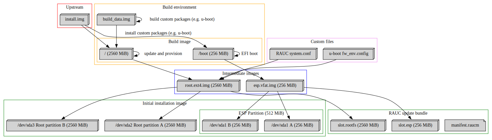

# Image scripts

This repository holds scripts to create and provision images and explores
A/B update scenarios using [RAUC](https://rauc.readthedocs.io/).

For this first iteration, we concentrate on a system with A/B setup for
[ESP](https://en.wikipedia.org/wiki/EFI_system_partition) and root filesystem
based on an upstream provided installation tarball.

Running

```
./src/create_image.sh
```

should create all required files (but this will take quite some time and it is
advisable to run this on a sufficiently fast machine!).

## Creating images

To allow booting and modification of the `aarch64` based target OS as an
unprivileged user, we make use of [QEMU](https://www.qemu.org)'s
`qemu-system-aarch64`, which can be run on an `x86_64` based host.
Various images are created using [libguestfs](https://libguestfs.org) (which
also relies on QEMU) as part of the build process.
For more details, refer to [src/create_image.sh](src/create_image.sh).

We build the following images:
- a *build image*, containing an ESP and a root filesystem into which we boot
  using an EFI based mechanism
- a *build data image*, used to build additional software in and install from
  (this is mounted using the booted *build image* in a separate step)
- a *root image*, which contains only the root filesystem (derived from *build image)
- a *boot image*, which contains only the ESP (derived from *build image)
- an *initial installation image*, which contains a partition two times the
  size of the *boot image*, used for the ESP A/B setup (based on *boot image*)
  and two partitions, used for the root filesystem A/B setup (based on *root
  image*). The partitions use default [Partition type
  GUIDs](https://en.wikipedia.org/wiki/GUID_Partition_Table#Partition_type_GUIDs)
  which allows systemd to automatically detect and mount them correctly.
- a *signed RAUC update bundle*, which contains the *boot image* and the *root
  image*

With the above we are able to provision an SD card using the *initial
installation image* and install an update to the running system using the
*signed RAUC update bundle*.



## RAUC

RAUC can interact with a set of bootloaders, but all of this requires
customization. We loosely follow the [documentation on integration with
u-boot](https://rauc.readthedocs.io/en/latest/integration.html#id5) and use
[multiple
slots](https://rauc.readthedocs.io/en/latest/scenarios.html#multiple-slots) in
a setup that allows us to not only update the root filesystem, but [also the
bootloader partition
itself](https://rauc.readthedocs.io/en/latest/advanced.html#update-bootloader-partition-in-gpt).

A [public key
infrastructure](https://rauc.readthedocs.io/en/latest/examples.html#pki-setup)
(PKI) is *required* for RAUC to sign and validate update bundles, which can be
installed on a target system.

On the target system an [/etc/rauc/system.conf](rootfs/etc/rauc/system.conf)
(see
[documentation](https://rauc.readthedocs.io/en/latest/reference.html#sec-ref-slot-config))
defines the compatible updates, the bootloader, the bundle format, the keyring
path (for verifying the update bundle) and the slots as well as their
configuration.

Using the following on the target system:

```
rauc install <name of bundle>
```

we are able to update the system using a RAUC update bundle. A subsequent
reboot uses the new image.

## U-boot

A custom [u-boot](https://u-boot.readthedocs.io/en/latest/) build and boot
script (see
[custom_build/uboot-raspberrypi400/boot.txt](custom_build/uboot-raspberrypi400/boot.txt))
is required for u-boot to store its environment data (aka. it's state) in a
custom location and boot in a A/B slot fashion.
The customization is done using a package (see
[custom_build/uboot-raspberrypi400/](custom_build/uboot-raspberrypi400/)) which
is built and installed in a virtual environment.

The u-boot build configuration relies on the aarch64 based `raspberrypi` preset
configuration and uses the following additional options:

- `CONFIG_SYS_REDUNDAND_ENVIRONMENT=y` to store the u-boot environment redundantly
- `CONFIG_SYS_MMC_ENV_DEV=0` to define the MMC device on which to store the environment
- `CONFIG_SYS_MMC_ENV_PART=0` to define the MMC partition on which to store the environment
- `CONFIG_ENV_SIZE=0x8000` to define 32KiB sized environment size
- `CONFIG_ENV_OFFSET=0x100000` to define the offset for the first environment storage location
- `CONFIG_ENV_OFFSET_REDUND=0x200000` to define the offset for the 2nd environment storage location
- `CONFIG_ENV_IS_IN_MMC=y` to define the storage location of the environment
  (on MMC) - the default is `CONFIG_ENV_IS_IN_FAT=y`, which stores in a FAT
  partition, but does neither allow redundancy nor configuration from userspace

In the target system a custom `/etc/fw_env.config` (see
[rootfs/etc/fw_env.config](rootfs/etc/fw_env.config)) ensures, that
the u-boot tools `fw_setenv` and `fw_printenv` can set and print the u-boot
environment as well, which is required for u-boot to know which of the rootfs
partitions to boot into.

## Systemd integration

Once the system boots and u-boot has chosen which of the slots to boot from and
we have left early userspace, systemd attempts to reach `graphical.target` by
default. On the way `multi-user.target` is passed, which pulls in
`rauc-mark-good.service` (a service to mark the current slot as "good").
The service requires the custom `app.target`, which itself pulls in
`app.service` (a dummy service that just succeeds in execution and serves as a
placeholder for an actual target application that we want to boot into) and
orders before it.
If `app.target` fails, systemd reboots the system and `rauc-mark-good.service`
is never reached.

This means: If `app.target` fails, we will return to the previous boot slot
after three failed attempts, as RAUC never marks the new slot as good.
Only if the target application(s) run successfully we are using the new slot.

## TODO

- add slot for all applications (e.g. `appfs`) in which images for [portable
  services](https://systemd.io/PORTABLE_SERVICES) are supplied, to allow
  updates separate from (but not without!) the bootloader and rootfs.
- add data partition for user data
- add build and signing infrastructure for custom packages
- create service that calls `rauc status mark-good`
- improve the PKI setup and store keys in a safe place
- load kernel image, dtbs, and initramfs from rootfs slot and only use the ESP
  slot for u-boot updates to improve robustness
- investigate and implement the use of a RAUC [rescue
  slot](https://rauc.readthedocs.io/en/latest/scenarios.html#additional-rescue-slot)
  to improve robustness
- investigate and implement system for automatic RAUC update bundle consumption
  (e.g. using a custom service polling for files on a dedicated partition or
  downloading images from the internet when connection is available)
- investigate over-the-air updates using
  [casync/desync](https://rauc.readthedocs.io/en/latest/advanced.html#rauc-casync-support)
- host custom packages in a repository which is used to install packages during
  creation of images instead of building them from scratch every time.

## License

All code is licensed under the terms of the GPL-3.0-or-later (see [LICENSE](LICENSE) file).

## Further reading

- [example of running aarch64 image using EFI](https://gist.github.com/robertkirkman/f79441c79811ad263f2f881f7864e793)
- [br2rauc - A RAUC and buildroot based setup](https://github.com/cdsteinkuehler/br2rauc)
